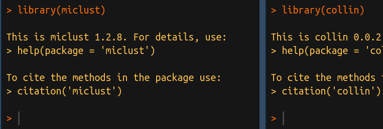

### At ISGlobal

- **collin** Visualizing the effects of collinearity in distributed lag models. [Package](software/collin.qmd)
- **miclust** Multiple imputation in cluster analysis. [Package](software/miclust.qmd)
- **optimalAllocation** Optimal allocation for longitudinal studies with time-varying exposure. [Package](software/optimalAllocation.qmd)
- **tlm** Effects under linear, logistic and Poisson regression models with transformed variables. [Package](software/tlm.qmd)

### Other collaborations

- **exploreGLM** Descriptive analysis and Generalized Linear Model exploration. [Package](software/exploreGLM.qmd)
- **IP** Index of Performance (IP) for the Rugby Attack Assessment Instrument (RAAI). [Package](software/IP.qmd)

### Just for fun

- **christmas** Generates a number of Christmas cards, most of them being animated. The name of each card includes the year in which it was created. [Package](software/christmas.qmd)
