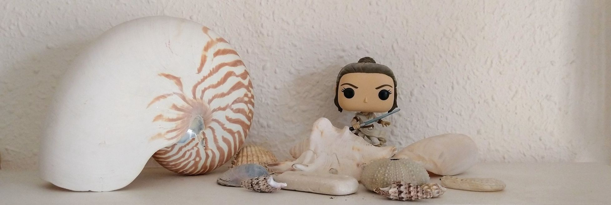

<!--  -->

<!--  -->

<!--  -->

### UAB

- [BSc in Applied Statistics](https://www.uab.cat/web/estudiar/ehea-degrees/general-information-1216708259085.html?param1=1264404714557):
  - Statistics in Health Sciences. 2010--present.
  - Cross-sectional Data Analysis. 2010--present.  
- [BSc in Computational Mathematics and Data Analytics](https://www.uab.cat/web/estudiar/ehea-degrees/general-information-1216708259085.html?param1=1345740824235):
  - Methods of Analysis in Health Sciences. 2021--present.  
- BSc in Political Sciences:
  - Fonaments Matemàtics i Estadístics. 2008--2009.  
- BSc in Sociology:
  - Fonaments Matemàtics i Estadístics. 2008--2009.  
- BSc in Computing engineering:
  - Probabilitat i Estadística. 2007--2009.  
- BSc in Biology:
  - Estadística. 2007--2008.

### UPF-UAB

- [MSc in Public Health](https://www.upf.edu/web/saludpublica):
  - [Statistics III](https://www.upf.edu/web/saludpublica/estadistica-iii). 2021--2025.

### UNA

- Máster (MSc) en Estadística y Metodología de la Investigación Científica, Básica y Aplicada. Facultad de Ciencias Exactas y Naturales. Universidad Nacional de Asunción:
  - Métodos para Datos en Categorías. 2013.
  - Curso de R avanzado. 2013.

### MSc thesis

- *Practical case of improving a geostatistical model and its implications*. Marta Cirach Pradas. Máster Universitario de Bioinformática y Bioestadística UOC-UB. 2025.

- *Traffic-related air pollution and risk for overweight or obesity in school-aged children in Barcelona, Spain*. (Statistical advisor. Directors: Martine Vrijheid and Maribel Casas). Jeroen de Bont. MSc in Public Health, Universitat Pompeu Fabra. 2017.

- *Modelización de variables radiométricas en la ciudad de San Lorenzo, Paraguay*. César Daniel Amarilla. Máster en Estadística y Metodología de la Investigación Científica, Universidad Nacional de Asunción. 2014.

- *Análisis de los factores asociados al parto pretérmino en la Cátedra Clínica Gineco-Obstétrica de la Facultad de Ciencias Médica - UNA*. Néstor Concepción Jara Landolffi. Máster en Estadística y Metodología de la Investigación Científica, Universidad Nacional de Asunción. 2014.

### BSc thesis

- *Associació a curt termini entre temperatures ambientals altes i accidents de vehicles a motor a Barcelona ciutat (2010-2023): Una anàlisi de sèries temporals*. Andrea Gonzalez Aguilera. Grau en Matemàtica Computacional i Analítica de Dades, Universitat Autònoma de Barcelona. 2025.

- *Creación de un paquete de R: detección de estados de vigilia y sueño*. Andrea Cadiz Giraldez. Grau en Estadística Aplicada, Universitat Autònoma de Barcelona. 2025.

- *Interpretabilitat i convergència en models de regressió per a prevalences*. Aplicació a enquesta sobre hàbits relacionats amb la salut en adolescents. Nuria Fernández Soriano. Grau en Estadística Aplicada, Universitat Autònoma de Barcelona. 2023.

- *Métodos estadísticos aplicados al baloncesto*. Paula Moreno Bláquez. Grado en Estadística Aplicada, Universitat Autònoma de Barcelona. 2022.

- *WhatsApp Infographic: Análisis gráfico de grupos de WhatsApp*. Aleix Pujol Gimeno. Grado en Estadística Aplicada, Universitat Autònoma de Barcelona. 2021.

- *Asociación entre la carga de las mochilas escolares y la salud de las espalda en adolescentes*. Iván Montero Arias. Grado en Estadística Aplicada, Universitat Autònoma de Barcelona. 2020.

- *Juego financiero: Trading con CFDs*. (Coadvisor: Mercè Farré) Yosry Elsayed. Grado en Matemáticas, Universitat Autònoma de Barcelona. 2020.

- *Anàlisi dels factors associats a la sinistralitat a les colles castelleres de Catalunya*. Núria Nogueras i Segura. Grau en Estadística Aplicada, Universitat Autònoma de Barcelona. 2020.

- *Analysing aberrant item score patterns in educational multiple choice exams and software implementation*. Alba Morató Catafal. BSc in Applied Statistics, Universitat Autònoma de Barcelona. 2018.

- *Evaluación del impacto de las legislaciones de control del tabaquismo en Europa: comparativa de las metodologías para análisis de medidas repetidas*. Marc Sampedro Vida. Grado en Estadística Aplicada, Universitat Autònoma de Barcelona. 2017.

- *Control mamogràfic de les dones espanyoles de 45 a 69 anys al llarg del 2012*. Gemma Serral Cano, Grau en Estadística Aplicada, Universitat Autònoma de Barcelona. 2015.

- *Factors de risc associats al coneixement de pràctiques preventives per prevenir una sobredosi en usuaris injectors d'heroïna*. Albert Espelt Hernàndez. Grau en Estadística Aplicada, Universitat Autònoma de Barcelona. 2015.

- *Efecto de la crisis económica en la asociación entre la privación socioeconómica y la mortalidad por causas externas en Barcelona*. Mercè Gotsens Miquel. Grado en Estadística Aplicada, Universitat Autònoma de Barcelona. 2015.

- [*exploreGLM*](software/exploreGLM.qmd)*: Exploración automática de un Modelo Lineal Generalizado mediante la creación de un paquete para el software estadístico R*. Patricia Ballesta Torre. Grado en Estadística Aplicada, Universitat Autònoma de Barcelona. 2013.

### Miscellanea

- [Example of GLM applied to COVID-19 epidemic in Spain](https://rpubs.com/overdispersion/covid19)
- [Brief introduction to modeling prevalences and rates in clustered populations using GLMM](https://jobago.github.io/prevalence-rate-clustered-data/)
- Introduction to ordinal regression ([slides in Spanish](materials/Regresion_Ordinal.pdf))
- [Drawing mathematical roses with R](https://rpubs.com/overdispersion/rose)
- Adding percentage labels to pie charts and bar plots ([script](materials/percentLabelsPiechartBarplot.R))
- Statistical tables ([pdf](materials/260531_statistical_tables.pdf))
